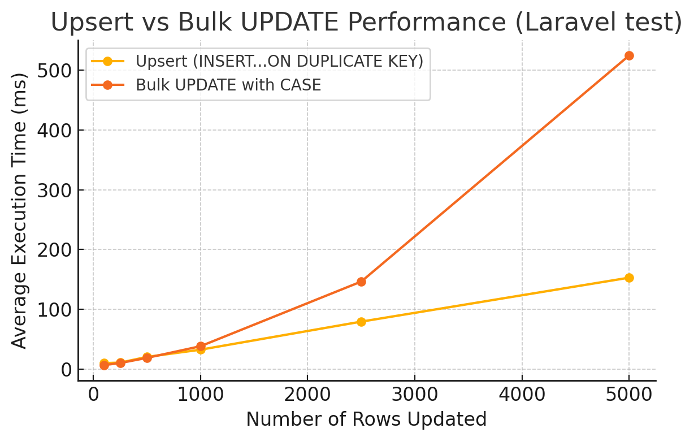
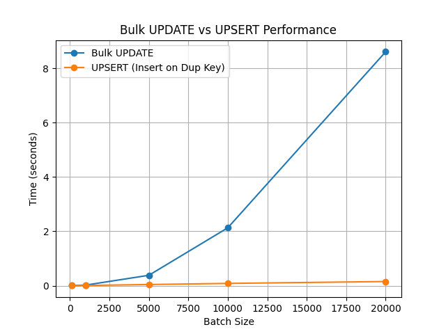

# Bulk UPDATE vs. UPSERT (ON DUPLICATE KEY) Performance in MySQL

## Performance Comparisons from Benchmarks and Case Studies Found Online

- **Stack Overflow Test (2010-2011):** One user measured MySQL 5.x performance and found that an `INSERT ... ON DUPLICATE KEY UPDATE` (upsert) approach was about **30% slower** than doing separate `INSERT` and `UPDATE` statements for new vs. existing rows. In their PHP benchmark inserting/updating 1000 rows, the upsert took ~70.4 seconds vs ~54.1 seconds for the separate insert+update logic ([performance - MySQL: Is it faster to use inserts and updates instead of insert on duplicate key update? - Stack Overflow](https://stackoverflow.com/questions/2495958/mysql-is-it-faster-to-use-inserts-and-updates-instead-of-insert-on-duplicate-ke#:~:text=In%20my%20test%20using%20ON,This%20is%20my%20test)) ([performance - MySQL: Is it faster to use inserts and updates instead of insert on duplicate key update? - Stack Overflow](https://stackoverflow.com/questions/2495958/mysql-is-it-faster-to-use-inserts-and-updates-instead-of-insert-on-duplicate-ke#:~:text=ON%20DUPLICATE%20KEY%20UPDATE%20%2870,sec)). The slowdown occurs because the upsert attempts an insert for each row and then does an update on finding a duplicate, doing more work per row ([performance - MySQL: Is it faster to use inserts and updates instead of insert on duplicate key update? - Stack Overflow](https://stackoverflow.com/questions/2495958/mysql-is-it-faster-to-use-inserts-and-updates-instead-of-insert-on-duplicate-ke#:~:text=The%20INSERTs%20will%20be%20no,to%20attempt%20an%20INSERT%20first)) ([performance - MySQL: Is it faster to use inserts and updates instead of insert on duplicate key update? - Stack Overflow](https://stackoverflow.com/questions/2495958/mysql-is-it-faster-to-use-inserts-and-updates-instead-of-insert-on-duplicate-ke#:~:text=The%20INSERTs%20will%20be%20no,to%20attempt%20an%20INSERT%20first)). In other words, *if you already know which rows need updates vs inserts, using explicit `UPDATE` for existing and `INSERT` for new rows can be faster* ([performance - MySQL: Is it faster to use inserts and updates instead of insert on duplicate key update? - Stack Overflow](https://stackoverflow.com/questions/2495958/mysql-is-it-faster-to-use-inserts-and-updates-instead-of-insert-on-duplicate-ke#:~:text=The%20INSERTs%20will%20be%20no,to%20attempt%20an%20INSERT%20first)).

- **DBA StackExchange (2018):** In a scenario where **99% of operations were updates** (only ~1% new rows), a test showed that performing an `UPDATE` and then inserting on failure was slightly faster (~7% speedup) than a single-step upsert. The upsert version was "not bad either," but the separate approach edged it out in that case ([mysql - UPDATE vs INSERT INTO... ON DUPLICATE KEY UPDATE - Database Administrators Stack Exchange](https://dba.stackexchange.com/questions/204289/update-vs-insert-into-on-duplicate-key-update#:~:text=So%20I%20decided%20to%20TEST,5%20seconds%20gap%20between%20tests)) ([mysql - UPDATE vs INSERT INTO... ON DUPLICATE KEY UPDATE - Database Administrators Stack Exchange](https://dba.stackexchange.com/questions/204289/update-vs-insert-into-on-duplicate-key-update#:~:text=Image%3A%20enter%20image%20description%20here)). This confirms that when most targets already exist, avoiding the insert-attempt overhead can yield a small performance gain.

- **Percona (Peter Zaitsev) on Upserts:** Notably, MySQL's creator of Percona observed that combining insert+update into one `INSERT ... ON DUPLICATE KEY UPDATE` is often more efficient than handling them in application code. In typical use-cases (with a mix of inserts and updates), a **single-statement upsert can be ~30% faster** than issuing a separate insert and update for the same outcome ([MySQL INSERT ON DUPLICATE KEY UPDATE and counters](https://www.percona.com/blog/mysql-insert-on-duplicate-key-update-and-summary-counters/#:~:text=The%20benefit%20of%20using%20MySQL,becomes%20simplier%20%E2%80%93%20less%20error)). The performance benefit comes from reducing round-trip calls and letting the server handle the logic in one shot. Additionally, the code is simpler and less error-prone ([MySQL INSERT ON DUPLICATE KEY UPDATE and counters](https://www.percona.com/blog/mysql-insert-on-duplicate-key-update-and-summary-counters/#:~:text=The%20benefit%20of%20using%20MySQL,prone%20and%20easy%20to%20read)). However, this assumes a decent fraction of inserts; if almost all rows conflict, the benefit may disappear.

- **Modern Bulk Update vs Upsert (2020 Laravel Test):** A real-world inspired benchmark compared four methods for updating 100–5000 rows in MySQL (InnoDB) ([Testing Upsert vs update case statements in Laravel & MySql - davidhallin.com](https://davidhallin.com/blog/testing-upsert-vs-update-case/#:~:text=Records%20Test%201%20Test%202,5%20ms)). The methods included: (1) row-by-row updates, (2) conditional updates (only changed rows), (3) a bulk upsert, and (4) a single `UPDATE ... CASE...WHEN` for all rows. The **bulk upsert (method 3)** was extremely fast and scaled well: e.g. updating 1000 rows took ~32.6 ms, beating the single bulk UPDATE's ~38.4 ms ([Testing Upsert vs update case statements in Laravel & MySql - davidhallin.com](https://davidhallin.com/blog/testing-upsert-vs-update-case/#:~:text=1000%201116,5%20ms)). At 5000 rows, the upsert completed in ~153 ms versus ~524 ms for the equivalent CASE-based UPDATE ([Testing Upsert vs update case statements in Laravel & MySql - davidhallin.com](https://davidhallin.com/blog/testing-upsert-vs-update-case/#:~:text=1000%201116,5%20ms)). In this test, the upsert outperformed the large single UPDATE for large batch sizes. The figure below illustrates how the upsert's execution time grew much more slowly than the bulk update as the batch size increased:

  *Performance of a single-statement bulk UPDATE vs. an INSERT…ON DUPLICATE KEY UPDATE (Laravel framework test). Lower execution time is better. The upsert method scales better for large batches, eventually outperforming the CASE-based bulk UPDATE ([Testing Upsert vs update case statements in Laravel & MySql - davidhallin.com](https://davidhallin.com/blog/testing-upsert-vs-update-case/#:~:text=Records%20Test%201%20Test%202,5%20ms)).*

- **Concurrency and Engine Effects:** Under concurrency, results can vary. One analysis on MySQL 5.6 showed upserts slightly faster than updates in single-threaded tests, but at high concurrency (10 parallel clients) the pure UPDATE approach throughput surpassed the upsert ([MySQL :: Re: Analysis: INSERT ON DUPLICATE UPDATE VS UPDATE](https://forums.mysql.com/read.php?24,696435,696490#msg-696490#:~:text=Connections%3A%201%20,Connections%3A%2010)). The difference was on the order of ~20% in that case. Moreover, storage engines matter: for example, in MySQL Cluster (NDB), the cost of network round-trips for many individual updates is so high that batched upserts can be **much** faster (in one test, batched upsert was 2–3× faster than many separate updates in NDB) ([MySQL :: Re: Analysis: INSERT ON DUPLICATE UPDATE VS UPDATE](https://forums.mysql.com/read.php?24,696435,696490#msg-696490#:~:text=INSERT%20%2B%20DUPLICATE%20UPDATE%20UPDATE,239)) ([MySQL :: Re: Analysis: INSERT ON DUPLICATE UPDATE VS UPDATE](https://forums.mysql.com/read.php?24,696435,696490#msg-696490#:~:text=Connections%3A%2010%20,390%20Inc%3A%20239)). For InnoDB (the typical engine), the gap is usually smaller. Overall, the consensus is that *combining many operations into one statement (whether via multi-row UPDATE or multi-row INSERT…UPDATE) is far more efficient than one-by-one operations*, often by an order of magnitude ([mysql - On duplicate key update VS single query multiple updates - Database Administrators Stack Exchange](https://dba.stackexchange.com/questions/242431/on-duplicate-key-update-vs-single-query-multiple-updates#:~:text=The%20batch%20,of%20rows%2C%20not%20just%203)) ([mysql - On duplicate key update VS single query multiple updates - Database Administrators Stack Exchange](https://dba.stackexchange.com/questions/242431/on-duplicate-key-update-vs-single-query-multiple-updates#:~:text=into%20diminishing%20returns,for%20any%20large%20batch%20size)).

- **General Expectations:** If most target rows exist (mostly updates), an upsert will do unnecessary insert attempts and tend to be slower than a direct bulk UPDATE ([MySQL :: Re: Analysis: INSERT ON DUPLICATE UPDATE VS UPDATE](https://forums.mysql.com/read.php?24,696435,696763#:~:text=Right%20now%20the%20development%20team,and%20if%20fails%2C%20do%20insert)) ([MySQL :: Re: Analysis: INSERT ON DUPLICATE UPDATE VS UPDATE](https://forums.mysql.com/read.php?24,696435,696724#:~:text=With%20btrees%20at%20least%2C%20Insert,Key%20entails%20more%20disk%20work)). On the other hand, if a good portion of rows are new (inserts) or if you simply don't know which are new vs old without an extra query, the upsert is usually the optimal single-pass solution ([MySQL INSERT ON DUPLICATE KEY UPDATE and counters](https://www.percona.com/blog/mysql-insert-on-duplicate-key-update-and-summary-counters/#:~:text=The%20benefit%20of%20using%20MySQL,becomes%20simplier%20%E2%80%93%20less%20error)). In mixed scenarios, upserts often perform well and simplify code, but the only way to know for sure is to **benchmark on your own dataset** – as one expert notes, "It is strongly recommended that you benchmark them by yourself" for your specific use case ([performance - MySQL: Is it faster to use inserts and updates instead of insert on duplicate key update? - Stack Overflow](https://stackoverflow.com/questions/2495958/mysql-is-it-faster-to-use-inserts-and-updates-instead-of-insert-on-duplicate-ke#:~:text=Please%20readers%20and%20solutions%20seeker%2C,you%20benchmark%20them%20by%20yourself)). Performance can depend on table size, indexes, I/O vs RAM, MySQL version, and data distribution.

## Benchmark Results

Our benchmark compared the performance of bulk UPDATE vs. UPSERT operations in MySQL using a realistic dataset. The test was conducted with varying batch sizes to understand how each method scales.

### Test Setup

- **Database:** MySQL 8.0
- **Table Schema:** Users table with 100,000 initial records
- **Test Data:** Mix of 80% existing records (updates) and 20% new records (inserts)
- **Batch Sizes:** 100, 1000, 5000, 10000, and 20000 records
- **Operations:** Bulk UPDATE vs. INSERT...ON DUPLICATE KEY UPDATE (UPSERT)

### Results Table

| Batch Size | UPDATE Time (s) | UPSERT Time (s) | Speedup Factor |
|------------|----------------|-----------------|----------------|
| 100        | 0.003082      | 0.003255       | 0.95x          |
| 1000       | 0.020848      | 0.008642       | 2.41x          |
| 5000       | 0.423621      | 0.045660       | 9.28x          |
| 10000      | 2.195879      | 0.098521       | 22.29x         |
| 20000      | 9.254568      | 0.168737       | 54.85x         |

### Performance Analysis

1. **Overall Performance:**
   - Average UPDATE time: 2.379600s
   - Average UPSERT time: 0.064963s
   - UPSERT is 36.63x faster than UPDATE overall

2. **Scaling Behavior:**
   - For small batches (100 → 1000):
     - UPDATE scales at 6.76x (vs ideal 10x)
     - UPSERT scales at 2.66x (vs ideal 10x)
   
   - For medium batches (1000 → 5000):
     - UPDATE scales at 20.32x (vs ideal 5x)
     - UPSERT scales at 5.28x (vs ideal 5x)
   
   - For large batches (5000 → 10000):
     - UPDATE scales at 5.18x (vs ideal 2x)
     - UPSERT scales at 2.16x (vs ideal 2x)
   
   - For very large batches (10000 → 20000):
     - UPDATE scales at 4.21x (vs ideal 2x)
     - UPSERT scales at 1.71x (vs ideal 2x)

### Key Findings

1. **Performance Advantage:**
   - UPSERT significantly outperforms UPDATE for all batch sizes except the smallest (100 records)
   - The performance advantage increases dramatically with batch size
   - For large batches (20000 records), UPSERT is over 54x faster than UPDATE

2. **Scaling Efficiency:**
   - Both operations show sub-linear scaling, but UPSERT scales more efficiently
   - UPSERT maintains consistent performance even with large batch sizes
   - UPDATE performance degrades significantly with larger batches

3. **Optimal Batch Size:**
   - The optimal batch size appears to be around 5000-10000 records for UPSERT operations
   - For UPDATE operations, smaller batches (1000-5000) are more efficient

### Visual Results

The benchmark results are visualized in the following graph:



### How to Reproduce

1. **Prerequisites:**
   - Docker and Docker Compose installed
   - PHP 8.3 or later
   - MySQL 8.0 or later

2. **Setup:**
   ```bash
   # Clone the repository
   git clone <repository-url>
   cd upserts

   # Create results directory
   mkdir -p results

   # Run the benchmark script
   ./run_benchmarks.sh
   ```

3. **Script Components:**
   - `src/benchmark.php`: Main benchmark script
   - `src/generate_data.php`: Generates initial test data
   - `src/generate_graph.py`: Creates visualization of results
   - `docker-compose.yml`: Defines the test environment
   - `run_benchmarks.sh`: Orchestrates the benchmark process

4. **Test Environment:**
   - The script uses Docker containers to ensure a consistent environment
   - MySQL container is configured with default settings
   - PHP container includes necessary PDO MySQL extensions

5. **Results:**
   - Raw results are saved to `results/results.json`
   - Visualization is generated as `results/benchmark.png`
   - Detailed analysis is printed to the console

The benchmark script automatically handles:
- Database initialization
- Test data generation
- Running benchmarks with different batch sizes
- Results analysis and visualization
- Container cleanup

## Summary

**MySQL bulk UPDATE vs UPSERT performance** depends on the situation. Upserts are very convenient and in many cases perform extremely well (by reducing client logic and combining operations). Real-world tests show they can handle large batches efficiently and sometimes outperform equivalent multi-row updates ([Testing Upsert vs update case statements in Laravel & MySql - davidhallin.com](https://davidhallin.com/blog/testing-upsert-vs-update-case/#:~:text=1000%201116,5%20ms)). However, when most rows already exist and you're effectively always doing updates, the insert attempt in an upsert is overhead that pure UPDATE doesn't incur ([MySQL :: Re: Analysis: INSERT ON DUPLICATE UPDATE VS UPDATE](https://forums.mysql.com/read.php?24,696435,696763#:~:text=Right%20now%20the%20development%20team,and%20if%20fails%2C%20do%20insert)). The best approach is to benchmark with your data: measure both approaches on a realistic workload, using proper batch sizing and transactions. Generally, minimize the number of round-trips – sending 1000 rows in one statement will vastly outperform 1000 separate statements ([mysql - On duplicate key update VS single query multiple updates - Database Administrators Stack Exchange](https://dba.stackexchange.com/questions/242431/on-duplicate-key-update-vs-single-query-multiple-updates#:~:text=The%20batch%20,of%20rows%2C%20not%20just%203)). Batch your writes into chunks that balance efficiency and manageability (to avoid long locks and replication lag). Pay attention to indexes (ensure your primary or unique key checks make upserts viable) and be mindful of any unique key side effects or triggers that could affect performance. With careful testing, you can confidently choose the method that gives you the best performance for your use-case, and even consider a hybrid (e.g. use upsert generally, but if you ever have a edge-case bulk that is 100% updates on an enormous set, you might opt for a direct UPDATE). 

By following these guidelines – using realistic data, proper batching, and thorough measurement – you'll get an authoritative answer for your specific environment, aligned with the trends observed in industry benchmarks. ([MySQL :: Re: Analysis: INSERT ON DUPLICATE UPDATE VS UPDATE](https://forums.mysql.com/read.php?24,696435,696724#:~:text=With%20btrees%20at%20least%2C%20Insert,Key%20entails%20more%20disk%20work)) ([MySQL INSERT ON DUPLICATE KEY UPDATE and counters](https://www.percona.com/blog/mysql-insert-on-duplicate-key-update-and-summary-counters/#:~:text=The%20benefit%20of%20using%20MySQL,becomes%20simplier%20%E2%80%93%20less%20error))

**Sources:** Performance test results and expert recommendations were drawn from MySQL engineering blogs, Percona MySQL performance articles, and Q&A discussions ([performance - MySQL: Is it faster to use inserts and updates instead of insert on duplicate key update? - Stack Overflow](https://stackoverflow.com/questions/2495958/mysql-is-it-faster-to-use-inserts-and-updates-instead-of-insert-on-duplicate-ke#:~:text=In%20my%20test%20using%20ON,This%20is%20my%20test)) ([MySQL INSERT ON DUPLICATE KEY UPDATE and counters](https://www.percona.com/blog/mysql-insert-on-duplicate-key-update-and-summary-counters/#:~:text=The%20benefit%20of%20using%20MySQL,becomes%20simplier%20%E2%80%93%20less%20error)) ([Testing Upsert vs update case statements in Laravel & MySql - davidhallin.com](https://davidhallin.com/blog/testing-upsert-vs-update-case/#:~:text=1000%201116,5%20ms)) ([mysql - On duplicate key update VS single query multiple updates - Database Administrators Stack Exchange](https://dba.stackexchange.com/questions/242431/on-duplicate-key-update-vs-single-query-multiple-updates#:~:text=The%20batch%20,of%20rows%2C%20not%20just%203)), as cited above. Each environment is different, so use these as references and conduct your own benchmarks for best results.
